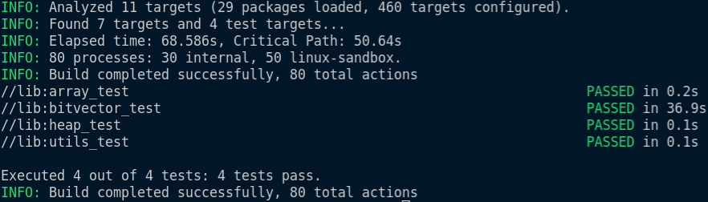

# Compact Temporal Graphs

This project aims to implement temporal graphs using compact data structures (CDS).
The goal is to implement several versions (v0, v1 ...) in which each version will 
use different sets of CDSs in its implementation, which we'll then compare memory and time efficiency in each of them.

## Setup

The chosen compiler for this project is Google's `bazel`. Please [install bazel](https://docs.bazel.build/versions/master/install.html)
before following the next steps.

### Python dependencies
- psutil: `pip3 install psutil`

## Unit testing

For this project we're using the GTest framework. To add new tests, add a build rule on the BUILD file and execute it with `bazel test <rule-path>`.

For example, to run the tests for the compact arrays in `lib/tests/ArrayTest.cpp`, run the build rule `array_test` in `lib/BUILD`:
- `bazel test lib:array_test`

Or, if you want to run all tests in a given folder (for example, the tests under `lib/`) run:
- `bazel test lib/...`

The output should look like this:

## Experimentation

The parameters for the experimentation are in the file `config.py`. You should first fill
the parameters as you like, before proceeding with the experimentation.

The experiments for temporal graphs are under the `temporalgraph` folder, on the `v<version_number>` subfolders. So, to run the experiments, on `temporalgraph` run:

- `python3 main.py`
- This will execute the experiments considering the parameters in `config.py`